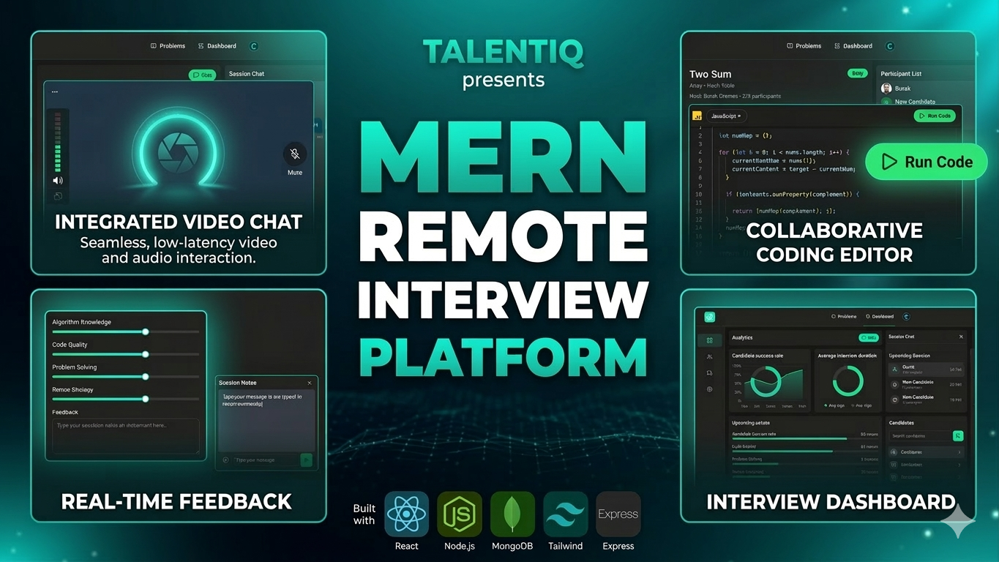

# 🚀 CodeSphere – Full-Stack Coding Interview Platform




A modern **full-stack web application** for conducting **real-time coding interviews**.  
Candidates and interviewers can **join secure rooms, write code, run tests, communicate via video, and get instant feedback**.

---

## 🌟 Key Features

* 💻 **VSCode-like Code Editor** for coding problems  
* 🔐 **Secure Authentication** powered by Clerk  
* 🎥 **Real-time Video Interview Rooms**  
* 📊 **Interactive Dashboard** with analytics  
* 🎤 **Mic & Camera Controls**, screen sharing & recording  
* 💬 **Live Chat System**  
* ⚡ **Secure Code Execution Environment**  
* ✅ **Automatic Code Evaluation**  
* 🎉 **Visual Feedback** (confetti on success, notifications on fail)  
* 🧩 **Practice Coding Mode**  
* 🔒 **Room Access Control** (2 participants max)  
* 🔄 **Background Jobs** with Inngest  
* 🧰 **REST API** using Node.js & Express  
* ⚡ **Optimized Data Fetching** via TanStack Query  
* 🤖 **Automated Code Review Assistance**  
* 🧑‍💻 **Git & GitHub Workflow** (branches, PRs, merges)

---

## 🖼 Screenshots


---

## 🛠 Tech Stack

### Frontend
* React, Vite, TanStack Query  
* Stream Video SDK

### Backend
* Node.js, Express.js  
* MongoDB  
* Inngest (async jobs)

### Authentication
* Clerk

### Deployment
* Cloud hosting (Vercel, Netlify, Sevalla free-tier friendly)

---

## ⚙️ Environment Variables

### Backend (`/backend`)
```env
PORT=3000
NODE_ENV=development
DB_URL=your_mongodb_connection_url

INNGEST_EVENT_KEY=your_inngest_event_key
INNGEST_SIGNING_KEY=your_inngest_signing_key

STREAM_API_KEY=your_stream_api_key
STREAM_API_SECRET=your_stream_api_secret


```
## Frontend (`/backend`)
```env
VITE_CLERK_PUBLISHABLE_KEY=your_clerk_publishable_key
VITE_API_URL=http://localhost:3000/api
VITE_STREAM_API_KEY=your_stream_api_key

```
▶️ Run Project Locally
1️⃣ Start Backend
```
cd backend
npm install
npm run dev

2️⃣ Start Frontend
cd frontend
npm install
npm run dev

